 

### 第三课、布尔逻辑与逻辑门

#### 1、Binary（二进制）：0和1，开和关

>  **电路闭合，电流流过，代表“真”，电路断开，无电流流过，代表“假”**

#### 2、布尔代数与布尔代数在计算机中运用

* 常量：`true`、`false`

* 运算符：`NOT`、`AND`、`OR`；`！`、`&&`、`||`（非、与、或）

* 所谓`门（gate）`: 控制电流流过的途径？晶体管只是点控制的开关，有三个引脚：2个电极，1个控制线

  > **控制线通电，电流从一个电极流到另一个电极**

* 当控制线，当作输入（input），底部的电极，当作输出（output）

  假如开打输入（input on），输出也会打开（output on），因为电流可以流过，输出结果（on）；

  反之，无电流通过，为`off`；正常情况，输入，输出相同。

**1）`NOT`运算符**

1. 命名：非门

2. 作用：反转布尔值，`!`，输入`true`或`false`，输出`false`或`true`

3. 晶体管的实现方式：INPUT，OUTPUT，GROUND

   a. INPUT->`ON`: `PN 结`电流可以流过，然后“接地”，OUTPUT->`OFF`

      从而实现：输入`ON`，输出`OFF`

   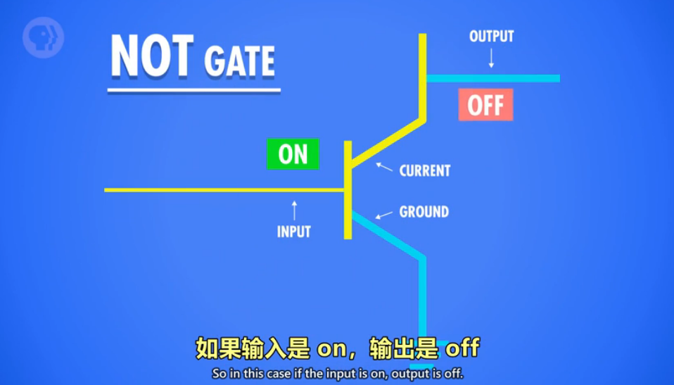

   

   b. INPUT->`OFF`: `PN 结`电流不可以流过，无法接地，只能从`OUTPUT`流过；OUTPUT->`OFF`
      从而实现: 输入`OFF`，输出`ON`
   ​    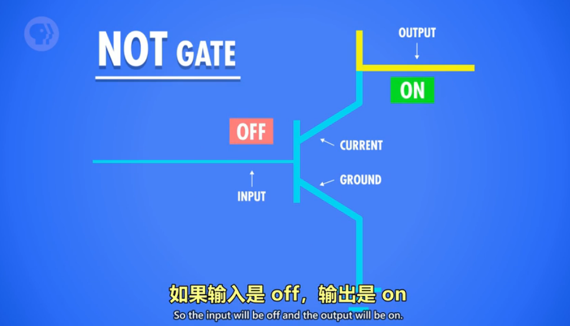

**2）`AND`运算符**

1. 命名：与门
2. 作用：两个输入控制一个输出，两个都为`true`，才输出`true`，否则为`false`

| INPUT A | INPUT B | OUTPUT |
| ------- | ------- | ------ |
| TRUE    | TRUE    | TRUE   |
| TRUE    | FALSE   | FALSE  |
| FALSE   | TRUE    | FALSE  |
| FALSE   | FALSE   | FALSE  |

3. 晶体管的实现方式：需要2个晶体管`串联`在一起，这样就有了 2 个输入，和 1 个输出；

   INPUT A->`ON`和 INPUT B->`ON`，才会有电流经过，OUTPUT->`ON`

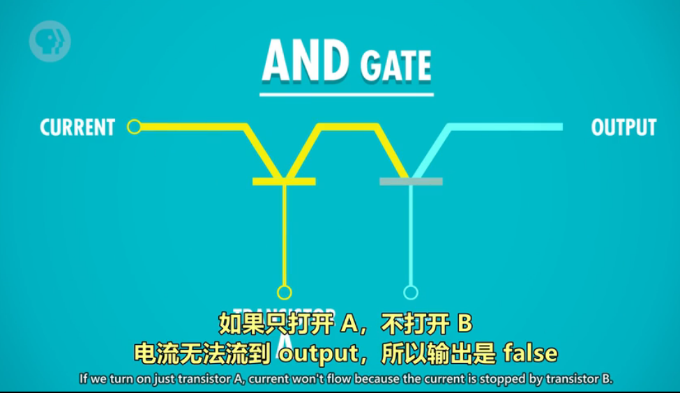

**3）`OR`运算符**

1. 命名：或门

2. 作用：由 2 个输入控制 1 个输出，只要其中 1 个输入为`true`，就输出`true`

   | INPUT A | INPUT B | OUTPUT |
   | ------- | ------- | ------ |
   | TRUE    | TRUE    | TRUE   |
   | TRUE    | FALSE   | TRUE   |
   | FALSE   | TRUE    | TRUE   |
   | FALSE   | FALSE   | FALSE  |

3. 晶体管实现方式：需要将两个晶体管`并联`在一起，由 2 个输入控制 1 个输出；

   a. 只要有 1 个 INPUT->`ON`，则 OUTPUT->`ON`，电流可以通过

   b. 2个输入都为`OFF`，则 OUTPUT->`OFF`，电流无法通过

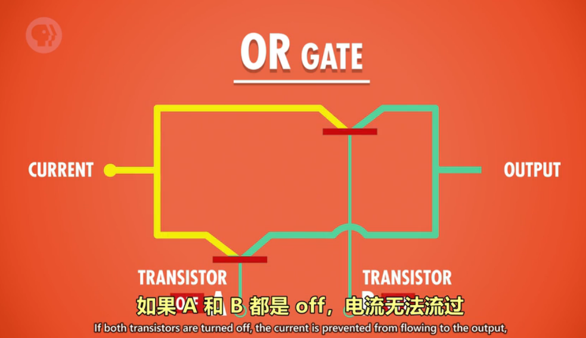

**4）`XOR`异或运算符** 

1. 命名：异或门

2. 作用：控制两个输出，输入同名，则输出`FALSE`，反之输出`TRUE`

   a. INPUT A ->ON,INPUT B->ON => OUTPUT->OFF

   b. INPUT A ->OFF,INPUT B->OFF => OUTPUT->OFF

   c. other => ON
   
   | INPUT A | INPUT B | OUTPUT |
   | ------- | ------- | ------ |
   | TRUE    | TRUE    | FALSE  |
   | TRUE    | FALSE   | TRUE   |
   | FALSE   | TRUE    | TRUE   |
   | FALSE   | FALSE   | FALSE  |
   
3. 晶体管实现方式：1个 `OR`, 2个`AND`, 1个`NOT`构成

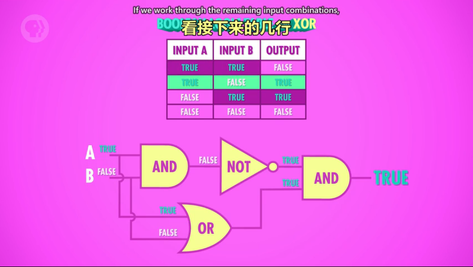

#### 3、逻辑门的符号

1. 作用：封装晶体管，使用符号简化标识

2. 符号：

   - 非门（`NOT`）：三角形 + 圆圈

   - 与门（`AND`）：圆形子弹头

   - 或门（`OR`）：似未喷火的火箭简笔

   - 异或门（`XOR`）：喷火的火箭简笔

    

### 第四课、二进制-Representing Numbers and Letters with Binary

#### 1、二进制的运算，以及原理

**1）十进制的原理：**每一位表示：10n，n >= 0; <kbd>100\`s</kbd><kbd>10\`s</kbd><kbd>1\`s </kbd>

`263`：2个100，6个10，3个1：2\*100 + 6\*10 + 3\*1 = 263

> 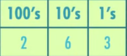 

**2）二进制的原理：**每一位表示：2n，n -> 0; <kbd>4\`s</kbd><kbd>2\`s</kbd><kbd>1\`s </kbd>

> **意味着每个乘数必须是右侧乘数的两倍**

`101`：1\*4 + 2\*0 + 1\*3 = 5

> 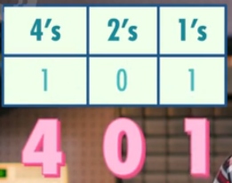 

**3）二进制与十进制转换**

`10110111`：每一位数乘以对应的进制数，再相加得到十进制数

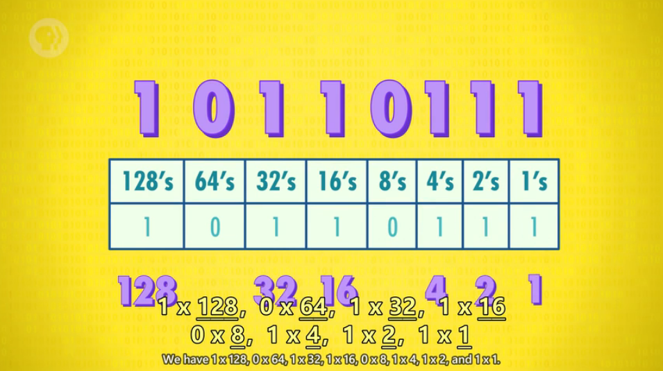 

**4）二进制加减运算**

`183 + 19`转换成二进制->`10110111 + 00010011`

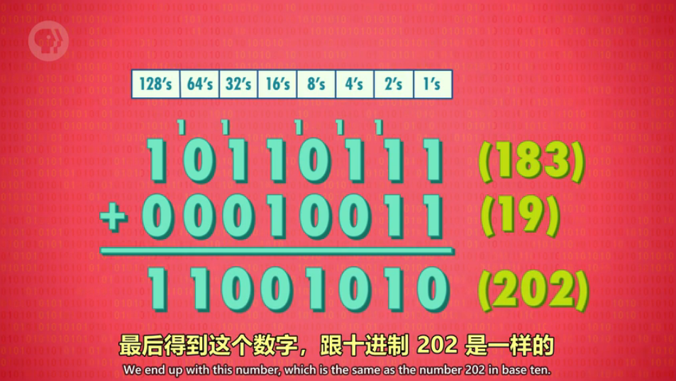  

#### 2、二进制的字节定义-Binary digit

**1）定义：**二进制中，一个`1`或`0`叫一位（`bit`）

以`8`位为例：最小`0`，最大`255`；能表示`256`个不同的值，也就是 28

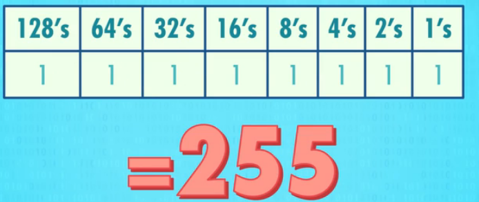 

 

**2）字节单位换算：`byte 字节` `kilobytes 千字节` `megabytes 百万字节` `gigabytes 十亿字节` `terabytes 万亿字节`**

> **每 8 位（bit），表示一个字节（byte）**
>
> **1 byte = 8 bits**
>
> ==十进制换算==
>
> **1 kb = 1000 bytes = 8000 bits**
>
> ==二进制换算==
>
> **1 kb = 210 = 1024 bytes**
>
> ==1000 转换成 2 进制，不方便计算，因此才使用与 1000 近似的值：210=1024==

#### 3、计算机操作系统位数：`32位`与`64位`

> 32位：最大能表示的数字：43亿左右, 231-1
>
> 64位：最大能表示的数字：9.2 \* 1018

> **大部分计算机使用第一位表示`正负数`->符号位**

**1) 浮点数**

> 最常见的是 IEEE 754 标准:
>
> 625.9 = 0.6259 \* 103
>
> 0.6259 <- 有效位数
>
> 3 <- 指数

 

> **二进制存储方式**
>
> 第一位：表示符号位
>
> 第二~九位：表示指数位
>
> 后面23位：表示有效位

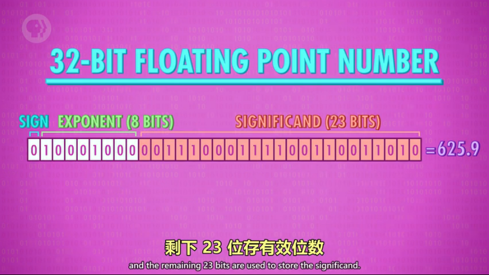 

**2）文字表示**

* ASCII: 美国信息交换标准代码, 发明与 1963 年；7位代码，足够存 128 个不同值
* Unicode：各国统一所有编码的标准；16 位，超过

### 第五课、算术逻辑单元-How Computers Calculate-the ALU

**一. 定义：计算机中负责运算的组件，它能执行算术（Arithemetic）和逻辑（Logic）运算**

> **真正的目标是计算，有意义的处理数字**
>
> 计算机的运算由==算数逻辑单元（ALU）==处理完成；ALU是计算的数学大脑

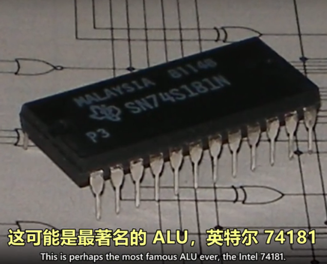 

**二. 结构：1 个算术单元和 1 个逻辑单元**

**1、算术单元：负责计算机里的所有数字操作；`1=TRUE` `0=FALSE`**

> 二进制两位数计算：
>
> a. 0+0=0,1+0=1,0+1=1；与异或逻辑门结果一致；

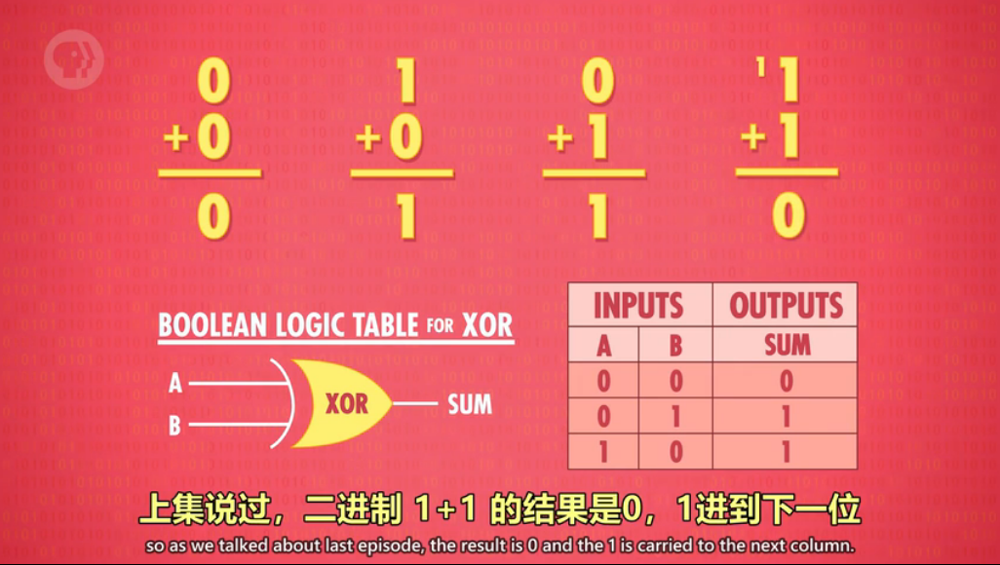 

>  b. 1+1=2，输出 0，进一位；需要并联一个`AND`逻辑门表示进一位；

 

**1）以上进制处理方式，封装为半加器**

1. 作用：计算加法
2. 实现方式：一个`XOR`与一个`AND`并联组成；

> 两个输入 A 和 B 都是 1 位；两个输出 “总和” 与 “进位”
>
> SUM-总和
>
> CARRY-进位

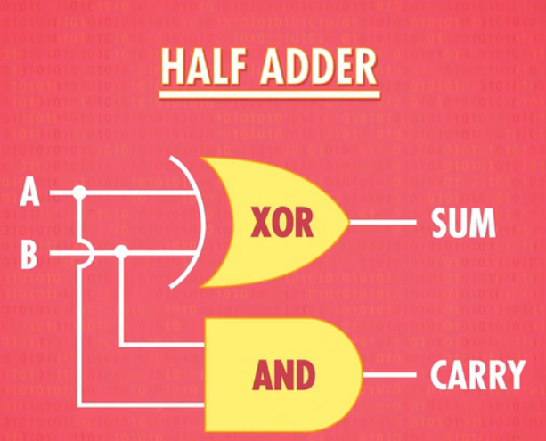 ==封装后====》 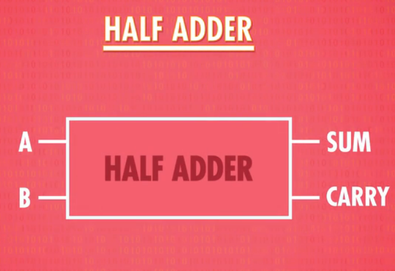 

**2）全加速器**

1. 作用：半加速器处理`1+1`，输出了进位，以此计算之后的每一列，都需要3个位在一起运算
   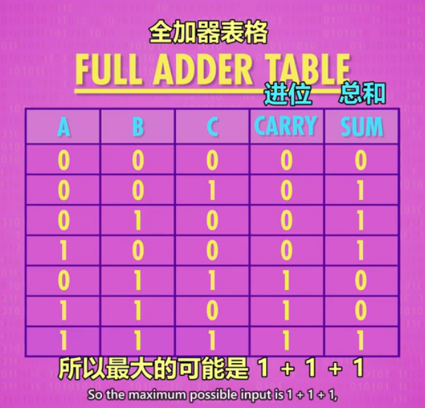
2. 实现方式：由两个半加器与一个`OR`组成

  > 1. A,B -> 半加器 -> SUM 1,CARRY 1
  > 2. C, SUM1 -> 半加器 -> SUM 2,CARRY 2
  > 3. CARRY 1,CARRY 2 ->`OR`-> CARRY 3

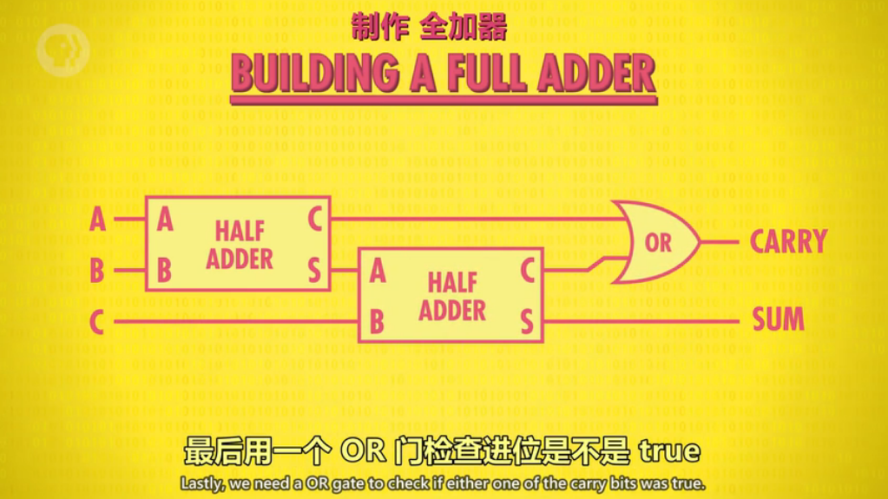 

3. 封装：将“全加器”作为一个独立的组件; `FULL ADDER`

   作用：把 A、B、C 三个输入加起来，输出 “总和” 和 “进位”

   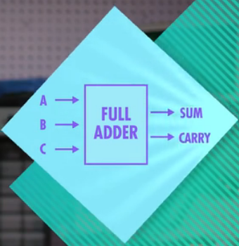 

4. **运算：制作 8 位加法器**

   a. 构成：1 个`半加器`与 7 个`全加器`

   b. 实现方式：第一位数通过`半加器`处理后，输出的进位与第二位数通过`全加器`运算，以此类推

   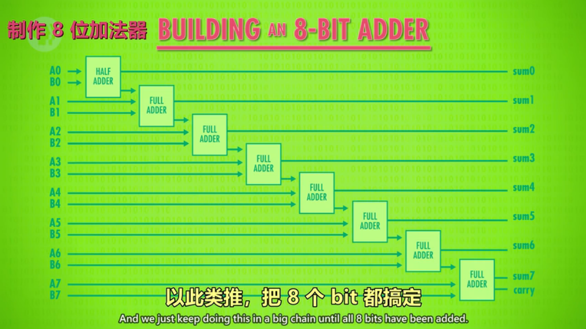 

   c. 最后一个`全加器`有 “进位” 的输出，表示第 9 位有进位，代表 2 个数字的和太大了，超过了 8 位；这叫 “溢出”（overflow）；

   d. 避免 “溢出”，需要更多的`全加器`，可以操作 `16`和`32`位数字，让溢出更难发生，代价是更多逻辑门，以及每次进位都要一点时间；

**3）超前进位加法器 - Carry-look-ahead adder**

   a. 定义：现代计算机使用的加法器。更快的处理速度;

**4) ALU的算术单元，其它数学运算**

> **一般 ALU 没有专门的乘法和除法电路 **
>
> <em>12 * 5</em> -> 12 个5相加，需要 5 次`ALU`操作来实现乘法

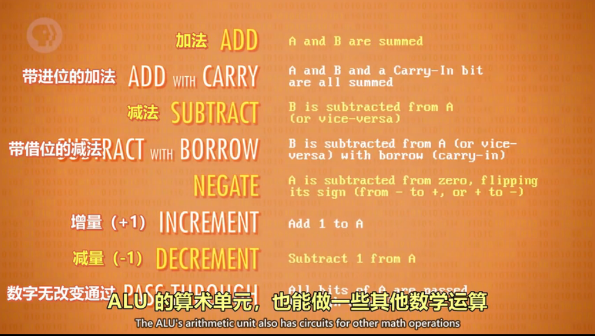 

**2. 逻辑单元**：逻辑单元执行逻辑操作

1）`ALU`逻辑单元使用 “V” 特殊符号表示:

   >**（8 BITS）**
   >
   >操作符：为 4 位，1000 = ADD，1100 = SUBTRACT
   >
   >标识：FLAG（1 BIT）：OVERFLOW, ZERO, NEGATIVE
   >
   >运算：INPUT A,B -==OPERATION CODE==-> OUTPUT（8 BITS）
   >
   >a. 两个数相减为 0 ，ZERO->TRUE：表示两个数相等
   >
   >b. 对比两个数的大小：A - B，NEGATIVE->TRUE
   >
   >c. 两个数相加溢出，OVERFLOW->TRUE

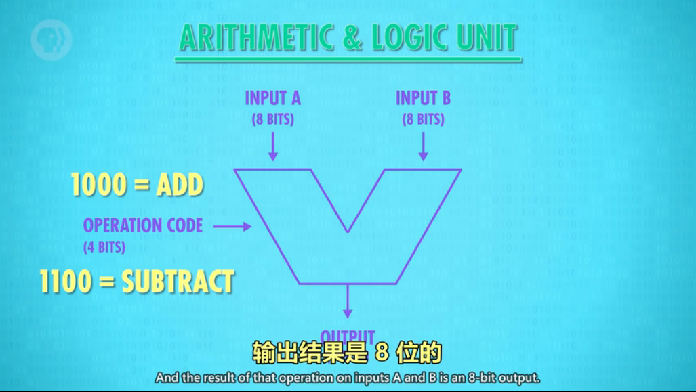

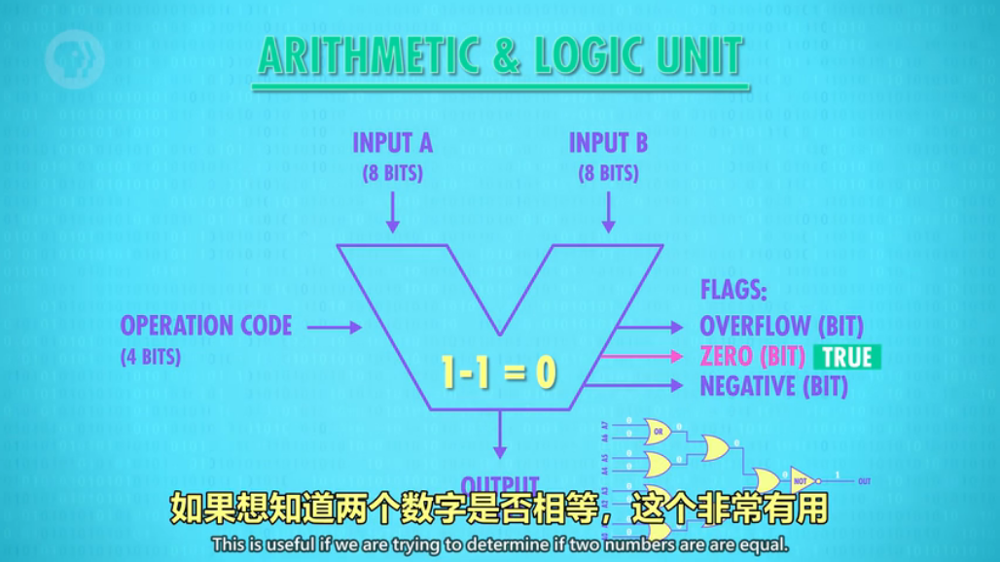 

### 第六章、寄存器 & 内存 - Registers and RAM

#### 1、课程概要：ALU 计算完成后，存储计算结果，以便后面多个连续的操作，这就需要内存。

- `RAM`：玩游戏时，如果断电进度会丢失；是因为电脑用的是`随机存取存储器`，简称`RAM`
- `Memory`：持久存储，电源关闭时，数据也不会丢失
- `目标`：制作存储 1 位的电路，再封装做出内存模块（与 ALU 组装做出 CPU）

#### 2、锁存器-AND-OR LATCH

- 构成：利用`OR`，`AND`，`NOT`逻辑门，来存储一位数

- 元件OR：`OR`存储`1`：A 输入 1 后，B形成回路，永久输出 1

  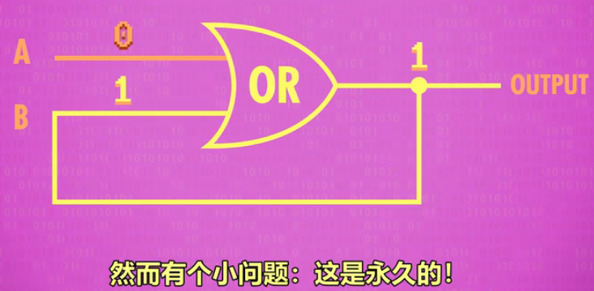  

- 元件AND：`AND`存储`0`: A 输入 1，一直输出 1；A 断开后，输出变成 0

  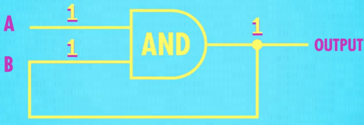    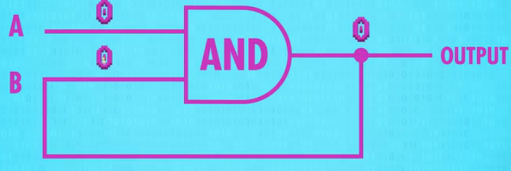 

- 实现方式：使用`OR`与`AND`结合起来，做出有用的存储（memory）-- “AND-OR” 锁存器

  > a. 构建：`OR`与`AND`组成回路存储数据，`NOT`复位输出
  >
  > b. 设置：`SET`输入，把输出变成 1
  >
  > c. 复位：`RESET`输入，把输出变成 0
  >
  > d. 设置与复位：都没有信号输入，电路会输出最后存放的内容
  >
  > **到此成功存入一个位数，这就是 “锁存”，锁定了一个值**

  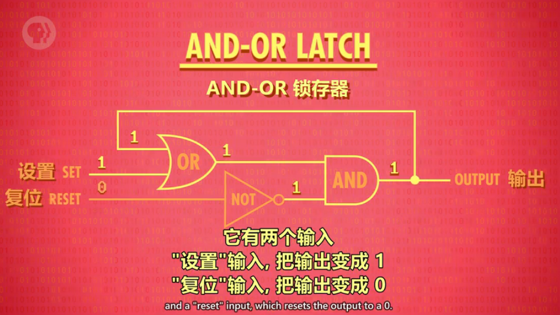

#### 3、**门锁：进一步优化锁存器，加入额外的逻辑门，这就是`门锁`**

**1）构成：**一根数据输入线，一根允许写入线（启用门锁），锁存器结构
**2）原理：**与`门锁一致`

**3）封装：**把`门锁`放在一个盒子里，这个盒子能存一个 `bit`

> a. 允许写入线（WRITE ENABLE）输入 1，数据输入（DATA IN）输入 1 ==> 数据输出 1
>
> b. 断开允许写入线，不管数据输入什么值，输出都不会变，值也就存储起来了
>
> c. 连接允许写入线，数据输入断开，重置数据，输出变为 0

  

#### 4、寄存器（课程以 8 位为例）- 存入一位（bit）数

**1) 构成：**多个锁存器并排组成，e.g：8个锁存器可以存 8 位（bit）信息，比如一个 8 bit 位数字

**2）用途：**存储一个数字，数字有多少位，叫`位宽`

**3）历史：**早期电脑用 8 位寄存器，然后是 16 位，32 位，64位

> a. 使用寄存器前，要先启用所有锁存器，使用导线连接所有 “允许输入线”，把它设为 1
>
> b. 然后用 8 条数据线发数据，再将 “允许输入线” 设为 0
>
> c. 8 位的值存储完成

#### 5、门锁矩阵

**1）构成：**寄存器通过网格形式排列，组成矩阵，这就是门锁矩阵

**2) 用途：**寄存器按照矩阵排列，节省导线，布局更为合理，也方便寻址

**3）矩阵：**以 256 位，16 * 16 网格的锁存器，16行，16列

> a. 启用某个锁存器：就打开相应的`行`与`列`
>
> b. 矩阵中，只允许一次启用一个`寄存器`，写入一位数
>
> c. 矩阵行列排法，用一根 “允许写入线” 链接所有锁存器（至于怎么做到的，不清楚，又不造CPU，管它了）
>
> d. 也是用一根==数据线==连接所有的锁存器

**4）矩阵中-单个寄存器结构**

> a. 行列：行列交叉点，通过`AND`门连接行列，行列都输入为 1 时，当前寄存器被选中
>
> b. 允许写入：行、列和==允许写入线==都必须是`1`，锁存器才被允许存入值；每次只有一个锁存器可以被选中写入数据
>
> c. 存入：因为每次只有一个锁存器启用，可以只用一根==数据线==连接所有锁存器来传数据
>
> d. 读取：与==允许写入线==相同的原理，==允许读取线==可以从一个指定的锁存器，读取数据

 

**5）总结**

- 因此矩阵只需要行列 32 条线，一条`数据线`，一条`允许写入线`，一条`允许读取线`，总 35 条线
- 以 8 位表示一个数字为例，需要 8 个寄存器才能表示一个数字

#### 6、多路复用器 - Multiplexer

**1）结构：**由 4 根导线，行/列导线组成

**2）使用方式：**将输入的二进制地址，转换为对应的行/列地址

> a. 矩阵图中，选中的是`12 行，8 列`，将行/列转换为二进制数：12=1100， 8=1000，可以写成：==11001000==
>
> b. 将地址输入多路复用器，由它寻找对应的寄存器

 

**3）封装：**将矩阵与多路复用器构成的组件，再次封装 - ==256-BIT MEMORY==

> 由 8 位地址线，数据线，允许写入线，允许读取线，构成一个 256 位内存

 

#### 7、内存

**1）存储一个 8 位数：**

a. 以下放置 8 个 256 位内存，可以存一个 8 位数，8 位（bit）也就是一个字节（byte）; ==8 bit = 1 byte==

b. 每个地址可以存一个 8 位（bit）数，总共能存 256 个字节（byte） 

 

 **2) 封装 RAM：将以上 8 个 256 位内存，看成一个整体的可寻址内存**

> a. 一个最基础的内存（RAM）结构
>
> b. 构成：一个 8-BIT 数据输入/输出线，一个 8-BIT 地址输入线，一个允许输入线，一个允许读取线
>
> c. 内存：共有 256 个地址，每个地址能读或写一个 8 位值
>
> d. 8 位最多能代表 256 个内存地址：1111 1111 是 255， 0~255 共 256 个数字

 

**3）总结**

**a. 内存的一个重要特性：可以随时访问任何位置**

b. 要给千兆或十亿字节的内存寻址，需要 32 位的地址; 因此叫 “随机存取存储器”（Random Access Memory），简称 RAM

c. 内存用途：记录当前在做什么事

> - 下图中一共由 8 个内存模块
>
> - 每个内存模块有 32 个内存方块
>
> - 每个内存方块由 4 个小块组成
>
> - 每个小块由存一个“位”的矩阵构成（门锁矩阵）
>
> - 图中的矩阵是 128 位 x 64 位，总共 8192 个位；
>
>   每个方块 4 个矩阵，一个方块共 32768 个位 （8192 \* 4）
>
>   每个模块 32 个方块，一个模块共 32768 \* 32 个位，大约存 100 万位
>
>   图中内存条有 8 个内存模块，约 8 \* 100 万位，也就是 1 兆字节（1 MB）

 

 

 

d. 上图是 1980 年代 1MB 的 RAM；如今的内存 GB 十亿级别的字节; 

上面就是 SRAM（静态随机存取存储器 Static Random-Access Memory）

e. 内存类型：DRAM，闪存（Flash memory）和 NVRAM

   不同类型的 RAM 原理类似，但使用不同的电路存单个位，比如用不同的逻辑门，电容器，电荷捕获或忆阻器

> **本质上，这些技术都是矩阵层层嵌套，来存储大量信息**

### 第七章、中央处理器（中央处理单元）（CPU）- The Central Processing Unit

> 课程介绍：CPU 控制

#### 1、

#### 2、

#### 3、

#### 4、

#### 5、

#### 6、
